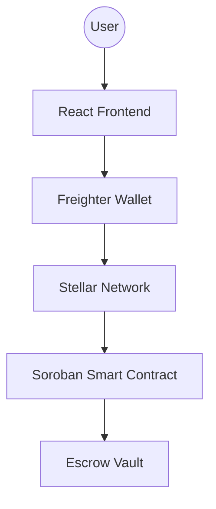

# Stellar Impact Architecture

## 1. Overview
Stellar Impact is a decentralized crowdfunding platform leveraging the Stellar network for transparent fund management. It uses Soroban smart contracts to enforce "milestone-based" releases of funds.

## 2. Component Diagram

## 3. Data Model
- **Campaign**:
    - `id`: Unique identifier
    - `creator`: Stellar Address
    - `goal`: Target XLM
    - `raised`: Current XLM
    - `milestones`: Array of milestone objects
    - `status`: Active / Completed / Cancelled
- **Donation**:
    - `donor`: Stellar Address
    - `amount`: XLM
    - `timestamp`: Date

## 4. Smart Contract Functions
- `create_campaign(title, goal, milestones)`: Initializes a new campaign and escrows funds.
- `donate(campaign_id)`: Accepts XLM from the user and updates state.
- `claim_milestone(campaign_id, milestone_id)`: Allows creator to request funds if triggers are met.
- `get_campaign(id)`: Returns current status.

## 5. User Onboarding Flow
1. Connect Freighter Wallet.
2. Browse campaigns.
3. Donate XLM via Stellar transaction.
4. Provide feedback via the integrated Google Form link.
